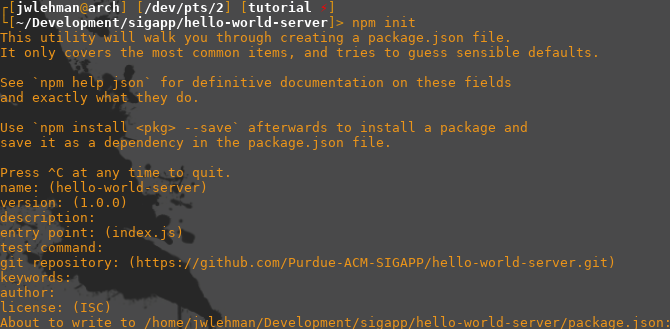
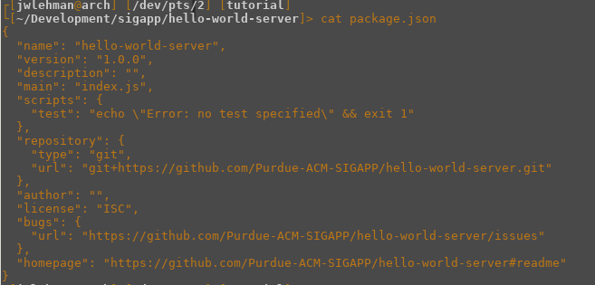

title: How to make a server
author:
  name: Jeremy Lehman
  twitter: htmlehman
style: style.css
output: tutorial.html
controls: true
theme: sjaakvandenberg/cleaver-dark

--

# Server 101
## How to be a backend master

--

###First Things First
`git clone 
https://github.com/Purdue-ACM-SIGAPP/hello-world-server.git`

--

#Follow Along @
##[website]

--

#Starting a Node project
##`npm init`

--

###package.json
`cat package.json`

--
###Install express
`npm i -S express`

