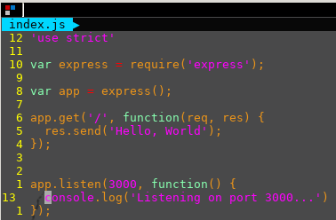
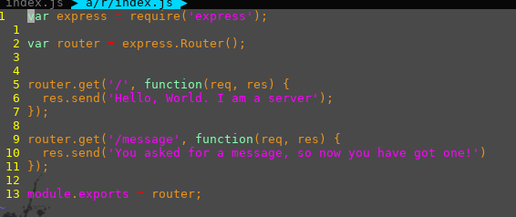
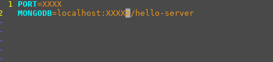

title: How to make a server
author:
  name: Jeremy Lehman
  twitter: htmlehman
style: style.css
output: tutorial.html
controls: true
theme: sjaakvandenberg/cleaver-dark

--

# Server 101
## How to be a backend master

--

###First Things First
`git clone 
https://github.com/Purdue-ACM-SIGAPP/hello-world-server.git`

--

#Follow Along @
##[website]

--

#Starting a Node project
##`npm init`

--

###package.json
`cat package.json`

--
###Install express
`npm i -S express`

--
###Create your first server!
create file `index.js` and add the following:

--
###Adding routes
`mkdir -p app/routes`
create file `index.js` and add the following:

--

#MongoDB
##

--

###Create data directory
* mac
  * `mkdir /data/db`
  * `sudo chmod 0755 /data/db`
  * `sudo chown $USER /data/db`
* windows
  * `md /data/db`

###Starting the mongo service and connecting to it
* `mongod` in a terminal
* open new terminal and run `mongo`
* type `help` to see what you can do

--
###configs
* create file `.env`
Add the following:

