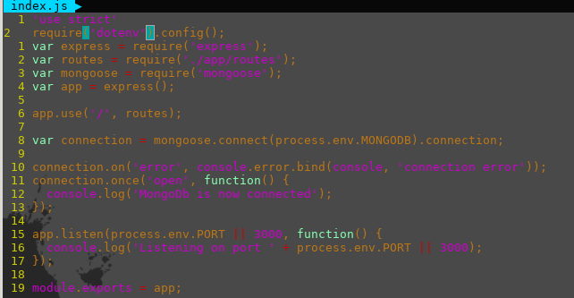
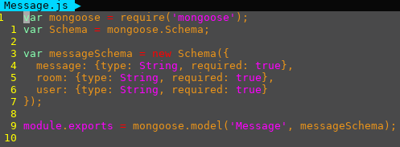
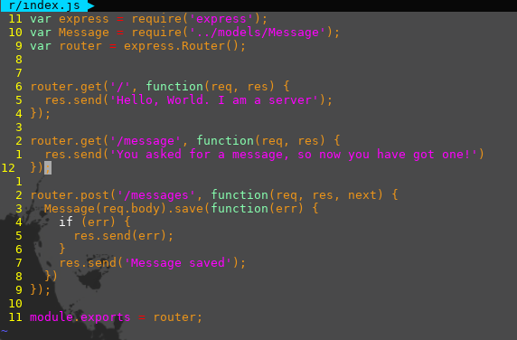
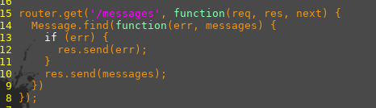

title: How to make a server
author:
  name: Jeremy Lehman
  twitter: htmlehman
style: style.css
output: tutorial.html
controls: true
theme: sjaakvandenberg/cleaver-dark

--

# Server 101
## How to be a backend master

--

###First Things First
`git clone 
https://github.com/Purdue-ACM-SIGAPP/hello-world-server.git`

--

#Follow Along @
##[website]

--

#Starting a Node project
##`npm init`


--

###package.json
`cat package.json`


--
###Install express
`npm i -S express`

--
###Create your first server!
create file `index.js` and add the following:


--
###Run your server!
`node index.js`
--
###Adding routes
* `mkdir -p app/routes`
* create file `index.js` and add the following:


--

#MongoDB
##https://www.mongodb.com/download-center?jmp=nav#community

--

###Create data directory
* mac
  * `mkdir /data/db`
  * `sudo chmod 0755 /data/db`
  * `sudo chown $USER /data/db`
* windows
  * `md /data/db`

###Starting the mongo service and connecting to it
* `mongod` in a terminal
* open new terminal and run `mongo`
* type `help` to see what you can do

--
###configs
* create file `.env`
* Add the following:

--

###Connect Mongo and the Server using mongoose
*  `npm i -S mongoose dotenv bodyparser`
* Add the following to index.js

--
###Run it
`node server.js`
--
###Create message model
* `mkdir app/models`
* create file `Message.js`
* add the following: 

--

###Add messages
* open `routes/index.js`
* add the following


--
###Test it out
* Download postman
* make a post request to `localhost:PORT/messages`
* in the body tab select raw and JSON
* add the following json data
```
{
  "message": "Hello",
  "user": "jeremy",
  "room": "Hello, World"
}
```
--

###Check in mongo
* open your mongo shell again
* type `use <DB>`
* type `db.messages.find()`

--
###Get messages
* open `routes/index.js` again
* add the following (also remove our old `/message` route)



###Check it out
* node `index.js`
* go to `localhost:PORT/messages`

--
###Last thing... Let's add a logger
* `npm i -S morgan`
* add the following to index.js


